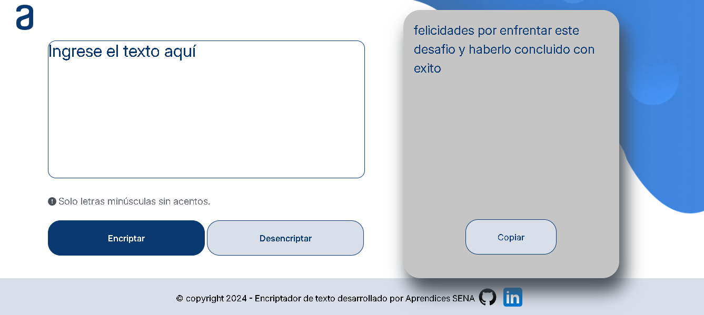

Encriptador de Texto

## Descripción

Este es un proyecto de encriptador y desencriptador de texto, desarrollado con HTML, CSS y JavaScript. La aplicación permite a los usuarios encriptar un mensaje de texto utilizando un algoritmo simple y posteriormente desencriptarlo. 

Las reglas de encriptación son las siguientes:
- La letra "e" es convertida en "enter".
- La letra "i" es convertida en "imes".
- La letra "a" es convertida en "ai".
- La letra "o" es convertida en "ober".
- La letra "u" es convertida en "ufat".

De la misma manera, el texto puede ser desencriptado para volver a su forma original.

## Funcionalidades
**Encriptar**: Convierte el texto ingresado en un mensaje encriptado.
- **Desencriptar**: Convierte el mensaje encriptado de vuelta a su texto original.
- **Copiar**: Permite copiar el mensaje encriptado o desencriptado al portapapeles.
- **Validaciones**: 
  - El texto debe estar en minúsculas.
  - No se permiten números ni caracteres especiales.
  - Se muestra un mensaje de error si el campo está vacío o si el texto ingresado no cumple con las reglas establecidas.

## Uso
1. Ingresa el texto que deseas encriptar o desencriptar en el área de texto.
2. Haz clic en el botón "Encriptar" o "Desencriptar" según sea necesario.
3. El resultado aparecerá en el área designada.
4. Puedes copiar el resultado haciendo clic en el botón "Copiar".

## Estructura del Proyecto

- **HTML**: Contiene la estructura de la página.
- **CSS**: Define el estilo visual del encriptador.
- **JavaScript**: Contiene la lógica de encriptación, desencriptación y validaciones.

## Requisitos
Para ejecutar este proyecto, necesitas:

- Un navegador web compatible con HTML5, CSS3 y JavaScript.

## Instalación

No se requiere instalación especial. Solo descarga o clona el repositorio y abre el archivo `index.html` en tu navegador.

```bash
git clone https://github.com/tu-usuario/encriptador-texto.git
```
## Tecnologías Utilizadas
- HTML
- CSS
- JAVASCRIPT

## Capturas de Pantalla

